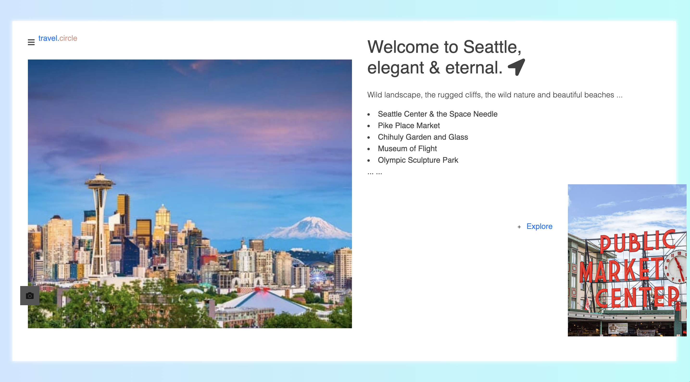

# SeattleGo

Independently designed a website which allows users to share, edit, cross-comment Seattle travel experiences with other participants

Have a look at website? Click here: [SeattleGo](https://seattle-go.herokuapp.com/)

# Feautures

- Authentication:

  - User login with username and password
  - User can not create new places, or posts comments without login

- Authorization:

  - One cannot edit or delete posts and comments created by other users

- Manage travel places posts with basic functionalities:

  - Create, edit and delete posts and comments
  - Upload campground photos
  - User register information include username, password and image which can show on the top of the website when logging in

- Flash messages responding to users' interaction with the app

- Responsive web design

# Build with

- Front-end:

  - EJS
  - Bootstrap
  - GoogleFonts
  - Fontawesome

* Back-end:

  - Express
  - MongoDB
  - Mongoose
  - Passport
  - Passport-local
  - Expression-session
  - Method-override
  - Momment
  - Connect-flash
  - Heroku
